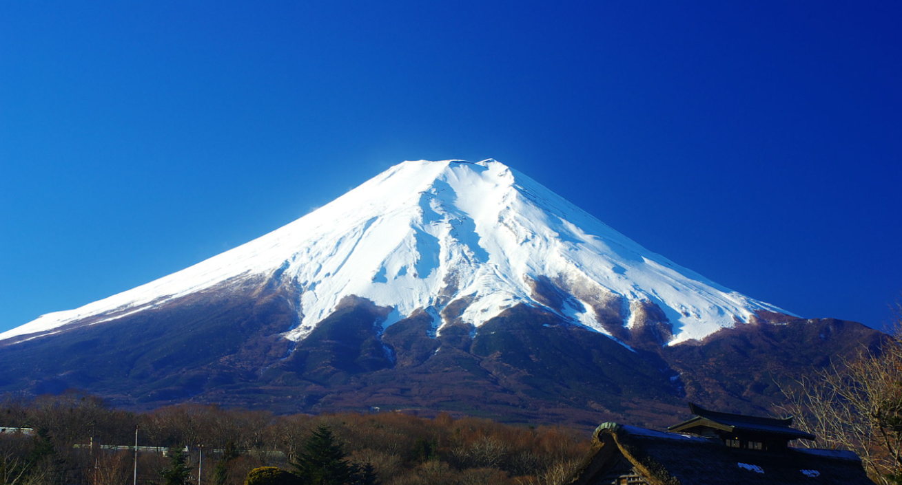
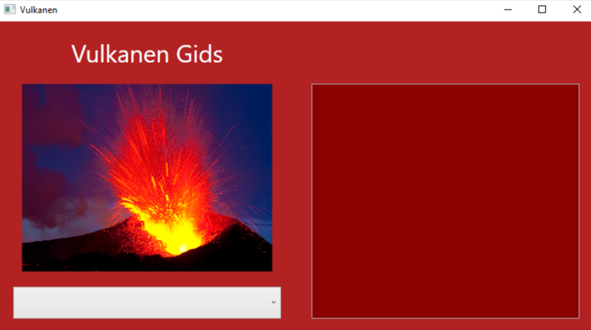
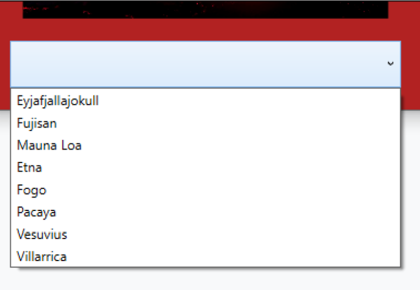
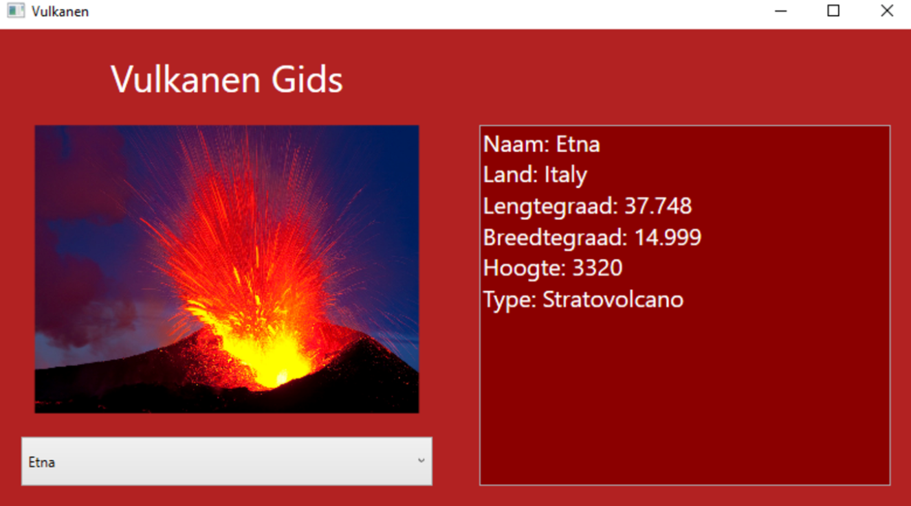

# 2DArrays-2---Vulkanen Gids:



Maak een applicatie waarin informatie is terug te vinden van ‘s werelds meest toeristische vulkanen.

## Applicatie layout:
In de layout wordt een Grid gebruikt waarin een Image, TextBlock, TextBox en ComboBox geplaatst is. De kleuren die gebruikt zijn in de applicatie zijn: White, DarkRed en Firebrick.

**Extra**: Gebruik een ViewBox om de titel “Vulkanen Gids” mee te laten schalen met de applicatie.



## Applicatie functionaliteit:

1. Als gebruiker kan ik op de ComboBox klikken om een lijst van de acht vulkanen te zien.



1. 2. Maak gebruik van een methode die je oproept bij het opstarten van het programma om de verschillende vulkanen in de ComboBox te laden.
3. Wanneer er een keuze wordt gemaakt in de ComboBox, dan wordt de extra informatie van de gekozen vulkaan onmiddellijk weergegeven in de TextBox.



4. Maak gebruik van de volgende array met kolomnamen om de vulkaan beschrijving structuur te geven.

```
private string[] kolommen = new string[6]
{
	"Naam", "Land", "Lengtegraad", 
	"Breedtegraad", "Hoogte", "Type"
};
```
5. Maak gebruik van de volgende 2D-array om de beschrijving van de geselecteerde vulkaan in te laden.
```
private string[,] vulkanen = new string[8, 6]
{
	{ "Eyjafjallajokull","Iceland","63.633",
	  "-19.633","1651","Stratovolcano" },
     { "Fujisan","Japan","35.361",
	  "138.728","3776","Stratovolcano" },
	{ "Mauna Loa","United States","19.475",
	  "-155.608","4170","Shield volcano" },
	{ "Etna","Italy","37.748",
	  "14.999","3320","Stratovolcano" },
	{ "Fogo","Cape Verde","14.95",
	  "-24.35","2829","Stratovolcano" },
	{ "Pacaya","Guatemala","14.382",
	  "-90.601","2569","Complex volcano" },
	{ "Vesuvius","Italy","40.821",
	  "14.426","1281","Complex volcano" },
	{ "Villarrica","Chile","-39.42",
	  "-71.93","2847","Stratovolcano" }
};
```


